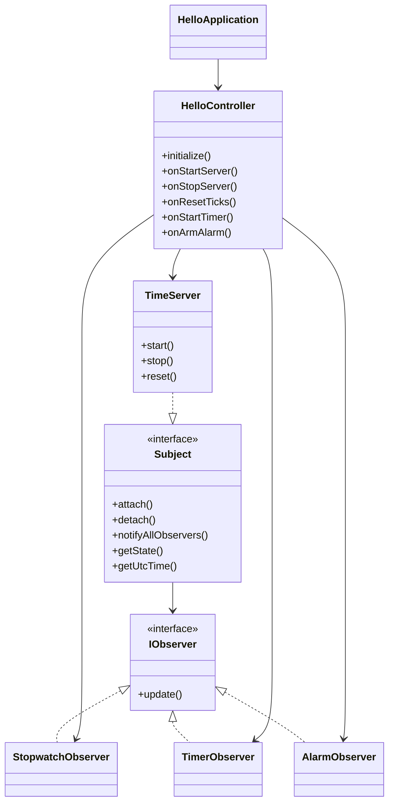

# Timer

## О проекте
Timer — десктопное JavaFX‑приложение, демонстрирующее поток событий от единого сервера времени (`TimeServer`) к нескольким инструментам: секундомеру, таймеру обратного отсчёта и пассивному будильнику. Сервер каждую секунду генерирует тик и рассылает обновления всем наблюдателям. Контроллер сцены отображает состояние сервера (запущен/остановлен, текущий тик, UTC‑метка), позволяет управлять компонентами и ведёт журнал действий.

## Возможности
- Запуск/остановка сервера времени, который считает тики с частотой 1 Гц и отображает текущее значение и UTC‑время последнего тика.
- Секундомер (`StopwatchObserver`), который форматирует прошедшее время в `MM:SS` или `HH:MM:SS`.
- Таймер обратного отсчёта (`TimerObserver`) с вводом количества секунд и отображением оставшегося времени либо статуса «Таймер сработал».
- Пассивный будильник (`AlarmObserver`), который один раз срабатывает после заданного смещения в тиках и информирует пользователя.
- Кнопка сброса тиков: обнуляет счётчик, таймер и будильник, не останавливая сервер.
- Текстовый лог в интерфейсе, куда `HelloController` пишет все пользовательские действия и служебные сообщения.

## Архитектура
- **Слой UI (`org.example.timeout`)**  
  `HelloApplication` загружает `hello-view.fxml`, `HelloController` управляет всеми элементами управления, подключает наблюдателей и маршализует обновления через `Platform.runLater`.
- **Сервер времени (`org.example.timeout.subject`)**  
  `TimeServer` реализует интерфейс `Subject`, использует `java.util.Timer` для генерации тиков и хранит состояние (счётчик тиков + UTC). Поддерживает операции `start/stop/reset`, а также привязку/отвязку наблюдателей.
- **Наблюдатели (`org.example.timeout.observer`)**  
  `IObserver` — контракт; `StopwatchObserver`, `TimerObserver` и `AlarmObserver` работают с UI‑контролами напрямую, инкапсулируя форматирование и бизнес‑логику конкретного инструмента.

Диаграмма зависимостей:



## Технологии и зависимости
- Java 21
- JavaFX 21 (`javafx-controls`, `javafx-fxml`)
- Maven + Maven Wrapper (`./mvnw`)
- OpenJFX Maven Plugin для локального запуска (`javafx:run`)
- JUnit 5 (заготовка для модульных тестов)

## Структура проекта
```
├── pom.xml
├── src
│   └── main
│       ├── java
│       │   ├── module-info.java
│       │   └── org/example/timeout
│       │       ├── HelloApplication.java
│       │       ├── HelloController.java
│       │       ├── observer/*.java
│       │       └── subject/*.java
│       └── resources
│           └── org/example/timeout/hello-view.fxml
└── target
```

## Требования
- JDK 21+
- Maven 3.9+ (не обязательно при использовании `./mvnw`)
- Среда с поддержкой JavaFX (macOS, Windows, Linux с установленным OpenJFX)

## Сборка и запуск
1. Установить JDK 21 и убедиться, что `JAVA_HOME` указывает на него.
2. Собрать проект и (при необходимости) запустить тесты:
   ```bash
   ./mvnw clean verify
   ```
3. Запустить приложение:
   ```bash
   ./mvnw javafx:run
   ```
   Maven плагин сам подтянет требуемые JavaFX‑артефакты и запустит `org.example.timeout.HelloApplication`.

## Сценарий использования
1. Нажмите «Запустить сервер» — индикатор состояния переключится на «Активен», а метки тиков и UTC начнут обновляться каждую секунду.
2. Чтобы проверить секундомер, просто наблюдайте за полем «Секундомер» — оно синхронизируется с общей шкалой времени без собственных таймеров.
3. Для таймера введите количество секунд и нажмите «Старт таймера». Отображение покажет оставшееся время, затем сообщение «Таймер сработал».
4. В блоке «Будильник» укажите смещение (в секундах) и нажмите «Перезапустить будильник»: статус покажет целевой тик, а после достижения отметки — сообщение о срабатывании.
5. Кнопка «Сбросить тики» обнуляет счётчик сервера, таймер и будильник. Каждый шаг фиксируется в журнале событий справа/снизу.

## Ограничения и планы
- Состояние не сохраняется между перезапусками.
- Все вычисления зависят от точности `java.util.Timer`; при больших нагрузках возможны небольшие задержки.
- UI рассчитан на демонстрацию и не адаптирован под мобильные устройства.
- Тестовое покрытие пока отсутствует — планируется добавить unit‑тесты для логики наблюдателей и сервера.

## Поддержка
Обратная связь приветствуется через Issues/PR внутри репозитория. Если нашли дефект — опишите шаги воспроизведения и ожидаемое поведение.
